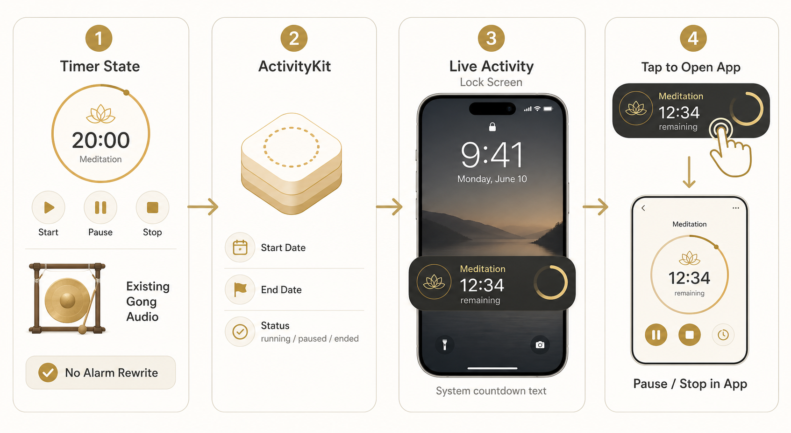
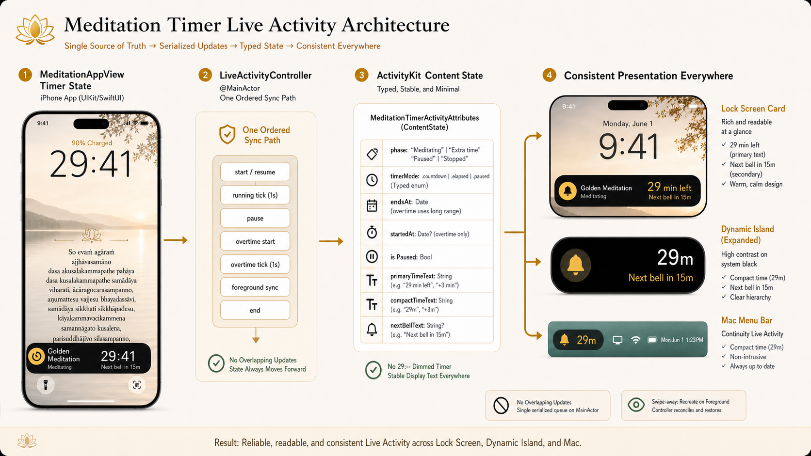

# Live Activity Design

This document describes the Live Activity design for the native iOS meditation timer.

## Goal

Show the meditation timer on the Lock Screen, Dynamic Island, and paired Mac without moving bell playback or timer ownership into a different alarm system. The iPhone app remains the source of truth for timer state and sound.

## Diagrams

### Concept Flow



### Final Design



## Architecture

The app has four boundaries:

- `MeditationAppView` owns session state, bell playback, pause/resume, and overtime.
- `MeditationLiveActivityController` is the ActivityKit boundary. It serializes Live Activity operations on `@MainActor`.
- `MeditationTimerActivityAttributes.ContentState` carries typed display state to the widget extension.
- `MeditationLiveActivityWidget` renders the same state across Lock Screen, Dynamic Island, and Mac menu bar surfaces.

The controller intentionally stays display-focused. It does not schedule alarms, own audio, or replace the existing background timer.

## State Model

The Live Activity state uses stable, codable values:

- `timerMode`: `.countdown`, `.elapsed`, or `.paused`
- `endsAt`: countdown end date, used by SwiftUI dynamic timer text while running
- `startedAt`: overtime start date, used by SwiftUI dynamic elapsed text during extra time
- `primaryTimeText`: readable main text such as `29 min left`, `43 sec left`, or `+3 min`
- `compactTimeText`: short text such as `29m` or `+3m`
- `nextBellText`: optional secondary text such as `Next bell in 15m`
- `nextBellAt`: optional next bell date, used by SwiftUI dynamic narrow relative text while running

The widget uses dynamic date rendering while the timer is running so Lock Screen and Dynamic Island text can keep moving even if the app is suspended. Paused and stopped states use stable text from state because they should not keep counting.

## Display Rules

Lock Screen:

- Warm cream background.
- Dark readable text.
- Main time uses SwiftUI dynamic timer text while running, and `primaryTimeText` while paused.
- Next bell uses `nextBellAt` while running, with a compact system relative style such as `Next bell in 14m` when the system locale allows it. `nextBellText` remains the paused fallback.

Dynamic Island:

- Treat system black as the background.
- Use white for primary time and soft gold for secondary text.
- Expanded mode aligns timer and next-bell hierarchy clearly.
- Compact mode has no leading or trailing content because macOS also reuses this presentation for menu bar Live Activities.

Mac menu bar:

- macOS receives the compact Live Activity presentation through Apple Continuity.
- There is no app-level switch for hiding only the Mac menu bar presentation, so compact content is intentionally empty.

## Lifecycle

- Start creates a new Live Activity after any existing one is ended.
- Running ticks update the existing activity through the serialized controller path.
- Pause creates a paused state if the activity was swiped away and the app is open.
- Overtime can update an existing activity or request a replacement if needed.
- Foreground sync recreates the display when a session is active and the Live Activity was dismissed.

## Non-Goals

- No separate alarm scheduling system.
- No server push updates.
- No full session restoration after process death in this iteration.
- No `activityStateUpdates` observer yet.

## Mac Sync

Mac menu bar Live Activities are Apple system behavior, not custom app synchronization. Apple Support says that after iPhone Mirroring connects to an iPhone, Mac automatically receives iPhone notifications and Live Activities, and Live Activities appear in the menu bar. Apple Human Interface Guidelines also note that active Live Activities appear in the menu bar of a paired Mac using compact, minimal, and expanded presentations.

References:

- https://support.apple.com/en-us/120684
- https://developer.apple.com/design/human-interface-guidelines/live-activities

## Verification

```sh
npm run test:timer
xcodebuild -project ios/App/App.xcodeproj -scheme App -configuration Debug -sdk iphoneos -destination 'generic/platform=iOS' CODE_SIGNING_ALLOWED=NO build
xcodebuild -project ios/App/App.xcodeproj -scheme App -configuration Debug -sdk iphonesimulator -destination 'generic/platform=iOS Simulator' CODE_SIGNING_ALLOWED=NO build
npm run ios:install
```

Latest verification on 2026-06-01: all commands above passed, and the app installed and launched on Eryu's iPhone 16 Pro.
