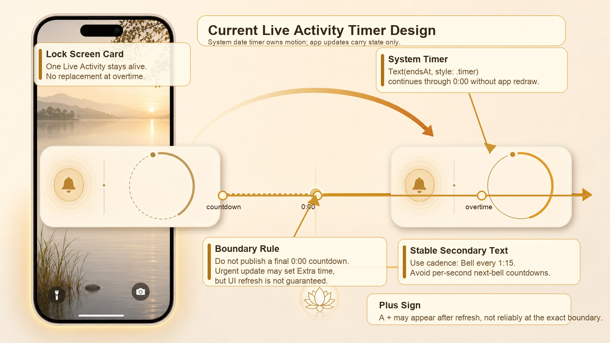

# Live Activity Notification Text Notes

These notes capture what we learned while iterating on the lock-screen Live Activity text.

## What Works

- Use SwiftUI dynamic date text for the primary timer:
  - `Text(endsAt, style: .timer)` for the active session timer, so it can continue past zero even if the boundary update is delayed.
  - `Text(startedAt, style: .timer)` for overtime count-up.
- Keep secondary Live Activity text stable when possible. A cadence label such as `Bell every 2m` or `Bell every 1:15` is more reliable than a second countdown.
- Snap display target dates to whole seconds before storing them in ActivityKit state. Sub-second jitter can make state appear different every tick.
- Use fixed-width trailing layout for the timer column so the primary timer and secondary bell text align visually.
- Treat the end boundary as a direct transition into overtime. The Live Activity should move from running countdown to count-up state without first publishing a `0:00` countdown state.
- Send the overtime transition as an urgent Live Activity update. It should not wait behind ordinary running-state refreshes, because the app may have very little execution time after the end bell fires in the background.
- Keep the same Live Activity when entering overtime. A background transition that immediately ends the old activity and requests a new one can fail with `visibility`, leaving no notification.
- Keep exact cadence formatting separate from countdown formatting:
  - Countdown text can round for readability, such as `Next bell in 2m`.
  - Cadence text should preserve non-minute intervals, such as `Bell every 1:15`.

## What We Observed

- The app reached overtime correctly, kept ticking internally, and logged `phase=Extra time mode=elapsed`.
- ActivityKit accepted the overtime update, but the visible notification could still remain on the previous rendered countdown view.
- Reopening the app triggered foreground sync and made the notification render the latest overtime state, including the `+` prefix.
- The most reliable visible behavior came from making the main timer a system date timer that can cross `0:00` by itself.
- The `+` prefix is not a reliable boundary signal. It can appear after a refresh, but should not be required for the notification to communicate that overtime is counting.

## What Does Not Work Reliably

- Do not expect ordinary `Text("41 sec left")` in a Live Activity to update every second. Widget extensions are not continuously running views.
- Do not rely on local ActivityKit updates every second to drive visible countdown text. iOS may throttle, coalesce, or delay updates.
- Do not use a secondary `next bell` dynamic countdown if it needs to roll over to the next bell. It can reach `0:00` and stay there until the app is allowed to push a new state.
- Do not make hidden or unused state strings change every tick. Even if the widget does not display them, changing content state can flood Live Activity updates.
- Do not enqueue a final `0:00 / Meditating` state before the overtime state. If iOS throttles or suspends the later update, the notification can stay stale and show a loading indicator.
- Do not let per-second Live Activity updates create a backlog ahead of session-boundary transitions.
- Avoid using relative date formatting for precise countdown behavior. It can be coarse and system-controlled.
- Avoid `Text(timerInterval: Date()...endsAt, countsDown: true)` for the main timer if the timer must survive the session boundary. It can stop at `0:00` when the widget does not re-render at exactly the end.
- Avoid `Text(timerInterval: startedAt...endsAt, countsDown: false)` for overtime if the widget fails to visually leave the old countdown state after ActivityKit accepts the update.
- Do not assume a local update from countdown mode to elapsed mode will always re-render the visible notification. If logs show ActivityKit accepted the new elapsed state while the UI stays at `Meditating / 0:00`, first verify the widget's dynamic timer expression before changing the ActivityKit lifecycle.
- Do not end and immediately request a replacement Live Activity from the overtime boundary. iOS can reject the replacement request with `visibility`.
- Do not rely on `TimelineView` inside the Live Activity to flip static surrounding text such as a `+` prefix at the session boundary. The system timer text can continue updating while the surrounding view tree does not re-evaluate until ActivityKit state refreshes.

## Current Design

- Primary lock-screen timer uses system dynamic timer text.
- `Text(endsAt, style: .timer)` is used while the session is active because it keeps moving past `0:00` without an app-driven re-render.
- The `+` prefix is only shown after the widget renders an elapsed/overtime state. It is intentionally not forced with `TimelineView` or per-second updates.
- The secondary bell line shows stable cadence text: `Bell every 2m`, `Bell every 1:15`, or `Bell every 0:45`.
- The app UI can still show `Next bell in ...`; that is app-controlled foreground UI and does not have the same Live Activity constraints.
- Live Activity updates should happen for real session state transitions, not as a per-second rendering mechanism.
